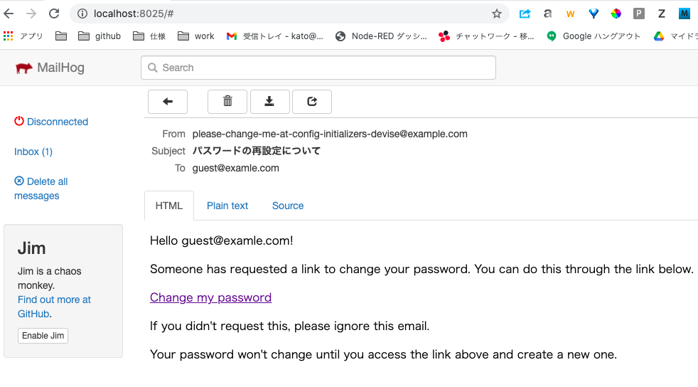

# docker-compose + rails で rspec を動作させる

docker-compose で rails のアプリをつくり、rspec の system テストを動作させてみます。  

テスト失敗時にスクリーンショットを撮るだけでなく、任意の場面でスクリーンショットを撮る事も試していきます。  

[https://github.com/katoy/sample-app](https://github.com/katoy/sample-app) に 作成した docker 環境の
コードをおいています。  
[https://github.com/katoy/sample-app/commits](https://github.com/katoy/sample-app/commits) で、下の操作の区切りの良い箇所で commit した様子がわからいます。アイル内容の変化を知ることができます。  

## 開発環境

- MacOS Catalina (10.15.7)
- docker desktop 3.3.1
- Docker 20.10.5
- docker-compose 1.29.1
- ruby ruby 2.7.3p183
- Rails 6.0.3.6
- MariaDB 10.4

## 作業概要

* docker-compose で app(rails), db(mysql), chrome (selenium) を構築します。
* rubocop の設定をします。
* devise 設定、rspec 設定をします。
* system spec ファイルを書いて、テストをパスさせます。
*  request spec ファイルを書いて、テストをパスさせます。
*  model spec ファイルを書いて、テストをパスさせます。


## docker-compose で app(rails), db(mysql), chrome (selenium) を構築

コンテナーに構成は、以下の図のようになります。  
(cat save/docker-compose.yml | docker run -i funkwerk/compose_plantuml --link-graph | docker run -i think/plantuml > output.svg で生成)  

||
|-


app は rails サーバー、 db は mysql, chrome は selenium で使う chrome です。  

次の操作をして、docker のコンテナを生成します。  

```console
$ mkdir ../sample-app  
$ cd ../sample-app  
$ cp ../test-with-docker/save/Dockerfile .  
$ cp ../test-with-docker/save/docker-compose.yml .  
$ cp ../test-with-docker/save/entrypoint.sh .  
$ cp ../test-with-docker/save/Gemfile .  
$ cp ../test-with-docker/save/Gemfile.lock .  
  
$ ocker-compose run app rails new . --force --no-deps --database=mysql --skip-test --webpacdker  
$ docker-compose build --no-cache  
```

docker-compose build は bundle install が走るので、時間がかかります。  
コンソールに作業経過が表示されるので、気長に待ってください。  

### データベース設定

```console
$ cp ../test-with-docker/save/Gemfile-01 Gemfile  
overwrite Gemfile? (y/n [n]) y  
  
$ cp ../test-with-docker/save/database.yml config/  
overwrite config/database.yml? (y/n [n]) y  
  
$ docker-compose build  
$ docker-compose run app bundle install  
$ docker-compose run app rails webpacker:install  
$ docker-compose run app rails db:create  
$ docker-compose run app rails db:migrate  
  
$ docker-compose up -d  
$ docker-compose logs -f app  
```

console に 下に示すような railse のサーバー起動終了のメッセージ  

```console
app_1     | => Rails 6.0.3.6 application starting in development   
app_1     | => Run `rails server --help` for more startup options  
     ... 省略  
app_1     | * Listening on tcp://0.0.0.0:3000  
app_1     | Use Ctrl-C to stop  
```

最後の "Use Ctrl-C to stop" が表示されるまで待機してください。  
ctrl-c でログ表示を終了します。  
そして http://localhost:3000 にブラウザでアクセスしてください。  
次の画面が表示されます。  

||
|-

## rubocop の設定

```console
$ gem install rubocop  
$ cp ../test-with-docker/save/dot-rubocop.yml .rubocop.yml  
$ rubocop  
```

警告がすこし表示されます。後で、修正をしていきます。  

## devise 設定、rspec 設定

```console
$ docker-compose run --rm app bash  
> bundle exec rails generate devise:install  
> bundle exec rails generate devise User  
> rails db:migrate  
> bundle exec rails generate controller home index  
> rails generate rspec:install  
> exit  
  
# cp ../test-with-docker/save/routes.rb config/  
  
$ docker-compose up -d  
```

再び http://localhost:3000 にブラウザでアクセスしてください。  
次の画面が表示されます。  

||
|-

## system テスト の実行

```console
$ mkdir spec/support  
$ cp ../test-with-docker/save/capybara.rb spec/support  
$ cp ../test-with-docker/save/sample_spec.rb spec/systems  
$ cp ../test-with-docker/save/home-index.html.erb app/views/home/index.html.erb  
$ cp ../test-with-docker/save/dot-rspec .rspec
$ mkdir screenshots/  
```

エディタをつかって、spec/rails-helper.rb の 23 行目付近の次の行のコメントを蓮します。(先頭の # を削除します)  

```ruby
Dir[Rails.root.join('spec', 'support', '**', '*.rb')].sort.each { |f| require f }
```

rspec を実行します。  

```console
$ docker-compose run --rm app bash  
> bundle exec rspec spec/systems  
```

* rspec の実行

||
|-

* screenshots/root.png

||
|-

sample_spec,rb では 2 つのテストをしています。  
1つは /home にアクセスした時の画面に "こんにちは" が含まれていること、  
もう１つは、/home にアクセスした時の画面に "こんばんは" が含まれていること、  

"こんにちは" が含まれていることのテストは聖句します。  
さらに page.driver.save_screenshot 'screenshots/root.png' としてスクリーンショットを撮っています。  

||
|-

2 つ目のテストは失敗します (わざと失敗させてます)  
system テストでは失敗した時に自動でスクリーンショットが tmp/scrinshots 以下に保存されます。  

||
|-

## devise の設定

ログイン制御を整備していきます。

```consode
$ rails g devise:views users  

$ cp ../test-with-docker/save/home_controller.rb app/controllers/home_controller.rb  
$ cp ../test-with-docker/save/application.html.erb app/views/layouts/application.html.erb  
$ cp ../test-with-docker/save/application.rb config/application.rb  
$ cp ../test-with-docker/save/routes.rb-2 config/routes.rb  
$ cp ../test-with-docker/save/devise.html.erb app/views/layouts/devise.html.erb  
```

config/initializers/devise.rb中の 次の行のコメントを外す。  

```
config.scoped_views = true  
```

```consolse
$ docker-compose restart app
$ docker-compose logs -f app
```

rails の起動が終了したのを確認したら、 ctrl-c で logs の監視を終了して、 http://localhost:3000 にアクセスします。

この編集作業により、次の湯に画面が変化します。  
ログインしていない状態で http://local:3000 にアクセスすると  

||
|-

ログインすると  

||
|-

devise の各種メッセージを日本語化します。  

Gemifile を編集する。  

```diff
git diff Gemfile
 gem 'bootsnap', '>= 1.4.2', require: false
 
 gem 'devise'
+gem 'devise-i18n'
+gem 'devise-i18n-views'
 
 group :development, :test do
 ```

config/application.rb を編集する。  

```diff
git diff config/application.rb
     config.load_defaults 6.0
+    config.i18n.default_locale = :ja
 
     # Settings in config/environments/* take precedence over those specified here.
```

docker-compos build, docker-compose up して http://localhost:3000 にアクセスしてみてください。  

||
|-

## mailhog の編集  

```vonsole
$ dc_run_rm bundle exec app rails g devise:views
```

 ```diff
git diff docker-compose.yml  
     ports:
       - 4444:4444
 
+  mailhog:
+    image: mailhog/mailhog:v1.0.0
+    ports:
+      - "8025:8025"
+
   app:
     build: .
 ```

config/environments/development.rb 編集  

 ```diff
git diff config/environments/development.rb  
   # routes, locales, etc. This feature depends on the listen gem.
   config.file_watcher = ActiveSupport::EventedFileUpdateChecker
+
+  config.action_mailer.delivery_method = :smtp
+  config.action_mailer.smtp_settings = { address: 'mailhog', port: 1025 }
+  config.action_mailer.default_url_options = { host: 'localhost', port: 3000 }
 end
```

この変更により、rail から送信されためメールは http://localhost:8025/ の画面から確認できるようになります。  

guest@example.com などで登録したアカウントのパスワード忘れ操作が可能になります。

||
|-

||
|-


## TODO リストの機能追加

```console
$ docker-compose run --rm app bundle exec rails generate scaffold task name:string status:boolean
$ docker-compose run --rm app bundle exec rails generate model connection user:references task:references
$ docker-compose run --rm app bundle exec rails db:migrate

$ docker-compose restart app
```

http://localhost:3000/task にアクセスして、タスク追加、一覧表示などをしてみてください。  

||
|-
タスク系画面の表示はログインが必要となるようにします。  
task_controoler を編集します。  


## AdminLTE 3 の導入

```console
$ yarn add bootstrap jquery popper.js
```

次のファイルの編集をします。  

config/webpack/environment.js

```diff
-const { environment } = require('@rails/webpacker')
+const {environment} = require('@rails/webpacker')
+
+const webpack = require('webpack')
+
+environment.plugins.append('Provide',
+    new webpack.ProvidePlugin({
+        $: 'jquery',
+        jQuery: 'jquery',
+        Popper: ['popper.js', 'default']
+    })
+)
 
 module.exports = environment
```

config/webpacker.yml

```diff
   # Additional paths webpack should lookup modules
   # ['app/assets', 'engine/foo/app/assets']
-  resolved_paths: []
+  resolved_paths: ['app/assets']
```

```console
$ mkdir app/javascript/stylesheets
$ touch app/javascript/stylesheets/application.scss
```

app/javascript/stylesheets/application.scss

```
@import "bootstrap";
```

app/javascript/packs/application.js

```diff
 require("@rails/activestorage").start()
 require("channels")
 
+import 'bootstrap';
+import '../stylesheets/application'; // This file will contain your custom CSS
+
+document.addEventListener("turbolinks:load", () => {
+  $('[data-toggle="tooltip"]').tooltip()
+});
```

http://localhost:3000/tasks にアクセスしてみると、フォントなどが変化してます。

||
|-

AdminLTE のテンプレートを画面に適用していきます。  

```console
$ docker-compose run --rm app yarn add admin-lte@^3.0
```

app/javascript/packs/application.js

```diff
 require("channels")
+require('admin-lte');
 
 import 'bootstrap';
```

app/javascript/stylesheets/application.scss

```diff
 @import "bootstrap";
+@import "admin-lte";
```

```consolse
$ docker-compose run --rm app yarn add @fortawesome/fontawesome-free
```

app/javascript/stylesheets/application.scss

```diff
 @import "bootstrap";
+@import "admin-lte";
+@import '@fortawesome/fontawesome-free';
```

app/views/layouts/application.html.erb  
(ファイル内容は github を参照してください)


```console
$ mkdir app/views/base
$ touch app/views/base/_header.html.erb
$ touch app/views/base/_sidebar.html.erb
$ touch app/views/base/_footer.html.erb
$ touch app/views/base/_control_sidebar.html.erb

$ cp ./node_modules/admin-lte/dist/img/AdminLTELogo.png app/assets/images/
$ cp ./node_modules/admin-lte/dist/img/user2-160x160.jpg app/assets/images/
```

app/views/base/*.html.erb, app/views/layouts/application.html.erb の変更内容は 
https://github.com/katoy/sample-app/commit/3cd3fb1907686ee595ee18edf19fea26b03a8342
を参照してきださい。  

次のような画面になります。  

||
|-


さらに、一覧、詳細、編集画面を bootstarp で整形します。  
変更内容は github を参照してください。

```
app/assets/stylesheets/tasks.scss  
app/javascript/packs/application.js  
app/javascript/packs/tasks/index.js  
app/views/base/_sidebar.html.erb  
pp/views/tasks/_form.html.erb  
app/views/tasks/edit.html.erb  
app/views/tasks/index.html.erb  
app/views/tasks/new.html.erb  
```

pp/views/tasks/show.html.erb
## rubocop 設定

Gemfile の developmetn ブロックに以下を追加する。  

```
  gem 'rubocop', require: false
  gem 'rubocop-performance', require: false
  gem 'rubocop-rails', require: false
  gem 'rubocop-packaging', require: false
  gem 'rubocop-rspec'
```

https://github.com/rails/rails/blob/main/.rubocop.yml
を copy して使うことにします。  
ただし、次のルールだけは変更します。  

```
# Style/StringLiterals:
#   Enabled: true
#   EnforcedStyle: double_quotes
```

rubocop 警告をなくしていきます。  
変数内容は github の commitw を参照してください。  
こんな画面になります。  

||
|-

## systm テスト の変更

ddevise を導入した際に、ログインしていないとページ閲覧出来ないようにしました。そのため現時点では、home ページのテストは失敗します。  
まずは、これが PASS するようにしていきます。  

ログイン画面に適切な値を入力し、ログインをする手続きを login というメソッドに記載し、それを呼び出してから テストを行うようにしています。  

変更点は github を参照してください。  

## requests テスト の実行

devise の sign_in というメソッドで、ログイン状態にすることができます。  

変更点は github を参照してください。  

||
|-

## models テスト の実行

TODO

## stripe をつかったクレジットカード支払い機能

5ドルの支払いをクレジットカードでする例を作ってみます。  
https://sloboda-studio.com/blog/how-to-use-stripe-in-ruby-on-rails-app/ の例を真似しているだけす。
ただし、シークレットキーの扱いを変更しています。  
config/credentials.yml.enc にキーを暗号化して記載するようにします。以下のように操作して config/credentials.yml.enc は編集します。　　

```
$ docker-compose run --rm app bash

$ EDITOR='vim' rails credentials:edit
　次のような行を追加する。

stripe:
  publishable_key: pk_test_51Ir0njJ .....
  secret_key: sk_test_...
```

キーの値は stripe のページ https://dashboard.stripe.com/test/apikeys に示されているテスト用のキー値を使います。  

http://localhost:3000/charges/new にアクセ死して、 [Pay With Card] ボタンをクリックします。  

||
|-

||
|-

テストに使えるクレジットカード番号は　https://stripe.com/docs/testing#cards を参照してください。  

stripe の支払い記録のページ https://dashboard.stripe.com/test/payments 
にアクセスすることで、支払い記録などを閲覧したり、返金処理ができます。  

||
|-


## 参考記事

- https://qiita.com/masarashi/items/61c5d9c63e9588b948f0
【Rails6】Docker + Rails + MariaDB のローカル環境でアプリ開発を始めよう【おとなもこどもも、おねーさんも】

- https://zenn.dev/junki555/articles/47e3173ae6e4f5
gem devise の Getting started 翻訳

- https://qiita.com/HiMinmeg/items/37a59cd266c63330797a
【初心者向け】deviseのユーザー登録をRSpecでテストする

- https://zenn.dev/junki555/articles/83339b5d58f416
 docker-compose 下で rails new して Rails6.1+deviseを試す

- https://qiita.com/piggydev/items/8a9f5cd4486861819a69
 【Rails】RuboCop 設定編（2020年10月版）

 - https://tech.actindi.net/2019/07/19/085019
 Rubocop Performanceを測ってみた。後編

 - https://qiita.com/Chanmoro/items/9a3c86bb465c1cce738a
 10分で理解する Selenium

- https://techblog.zozo.com/entry/qa-webui-test-automation-01
 Web UIテスト自動化の実行環境をSelenium Gridで

- https://techblog.zozo.com/entry/autify-introduction
 Autifyを導入してE2E自動テストを最適化した話

- https://manabu-ito.hatenablog.com/entry/2020/11/12/232236
 パスワードリセット機能の実装(sorcery)・letter_opener_webで、開発環境では実際にメール送らないように設定

- https://qiita.com/tomoharutt/items/596388788af9bedd68ff
 deviseのログイン画面でのみ、application.html.erbを除外する

- https://qiita.com/nkekisasa222/items/ea79b522d9fdf83aa484
 [Rails]'devise'エラーメッセージの日本語化

- https://qiita.com/onikan/items/1dd9ebfa891632d60e73
 【Rails6】Action mailerでメール送信までを解説してみる。(MailHogも使うよ)

- https://ccbaxy.xyz/blog/2019/11/06/ruby11/#moderu
 Ruby on Rails での多対多のアソシエーションの設定方法

- https://dev.to/brayvasq/integrate-andminlte-with-ruby-on-rails-6-od7
 Integrate AndminLTE with Ruby On Rails 6

- https://medium-company.com/rails6-adminlte-%E4%B8%80%E8%A6%A7%E7%94%BB%E9%9D%A2/#applicationhtmlerb
 Rails + AdminLTEで一覧画面を作成する

- https://www.betterspecs.org/
 What is Better Specs

- https://laptrinhx.com/rails-rspecde-devisenosingn-inwo-shitteroguin-chu-liwo-shuku-1607707419/
 【Rails】Rspecで、deviseのsingn_inを使ってログイン処理を書く

- https://techtechmedia.com/font-awesome-rails6/
 【Rails】Rails6でFontAwesomeを導入・表示させるための手順を初心者向けに解説

 - https://qiita.com/t2kojima/items/ad7a8ade9e7a99fb4384
 Rails5でコントローラのテストをController specからRequest specに移行する


 - https://sloboda-studio.com/blog/how-to-use-stripe-in-ruby-on-rails-app/
 How to Use Stripe in Ruby on Rails App

- https://techtechmedia.com/credentials-masterkey-rails/
 【Rails】「credentials.yml.enc」と「master.key」の使い方について詳しく解説！

- https://stackoverflow.com/questions/65116860/
 Accessing file downloads from containerized RSpec/Capybara and Selenium Chrome

- https://techracho.bpsinc.jp/hachi8833/2017_09_28/45536
 Rails: ActiveModelSerializersでAPIを作る–Part 1（翻訳）

- https://techracho.bpsinc.jp/hachi8833/2017_10_03/45639
 Rails: ActiveModelSerializersでAPIを作る–Part 2 RSpec編（翻訳）

 - https://qiita.com/minato-naka/items/3b0bcf0788a2150f3171
 OpenAPI（Swagger）のAPI開発Docker環境を整備した（yaml分割編集、SwaggerUI表示、モックサーバー、静的HTML出力）
